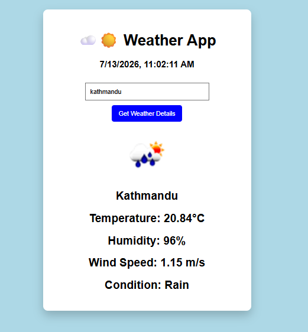

# 🌤️ Weather App

A simple and responsive weather application built with HTML, CSS, and JavaScript. It fetches real-time weather information using the OpenWeather API.

## ✨ Features

- 🌍 Search weather by city name
- 🌡️ Display current temperature
- 💧 Show humidity
- 💨 Display wind speed
- ☁️ Show weather condition
- 🖼️ Dynamic weather icons
- 📅 Display current date and time
- ⌨️ Search using the Enter key
- ⚠️ User-friendly error handling
- 📱 Responsive design

## 🛠️ Technologies Used

- HTML5
- CSS3
- JavaScript (ES6+)
- OpenWeather API

## 🚀 Installation

```bash
git clone https://github.com/sam123227/weather-app.git
cd weather-app
```

Then open `index.html` in your browser.

## 📸 Screenshot




## 🎯 Learning Outcomes

- Fetch API
- Async/Await
- DOM Manipulation
- Error Handling
- Working with REST APIs
- Responsive Web Design

## 👨‍💻 Author

**Samir**
